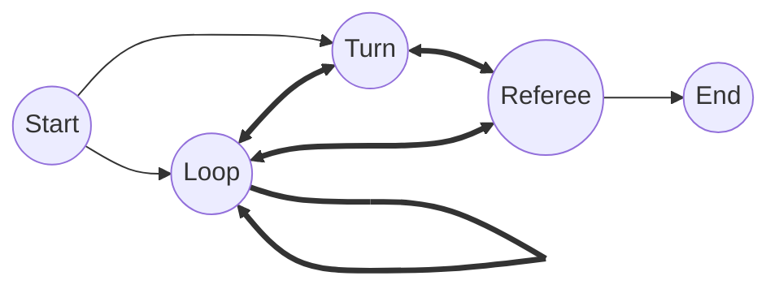

# Máquina de estados de la batalla
Para las batallas, las cuales suceden en la escena `res://assets/battle/battle.tscn`, definimos los siguientes estados:

- `Start`: para el inicio del juego y la configuración
- `Turn`: para jugar el turno del humano
- `Loop`: para rotar los turnos entre los jugadores no humanos
- `Referee`: para decidir las partidas y preparar la siguiente ronda
- `End`: para calcular los ganadores y mostrarlos en pantalla

Cada estado tiene de nombre de clase `Battle*`, donde `*` es el nombre de arriba, La organización de los estados es el siguiente:

```
o Battle
|-...
|-o BattleManager
| |-o Start
| |-o Turn
| |-o Loop
| |-o Referee
| |-o End
|-...
```

## Paso a paso de cada estado



### `Start`
1. Pone la música de batalla
2. Crea el jugador humano
3. Crea los jugadores bots
4. Le pide al manager inicializar la interfaz y el mundo 3D
5. Pasa el turno al bot o al humano segun quien empieza

### `Turn`
1. Le pide al manager que active el dado
2. Espera a que el manager le diga que el dado fue lanzado por un humano
3. Define las rocas disponibles para moverse y las resalta
4. El manager se encarga de lo que pasa cuando se selecciona una roca y luego una carta **aunque no deberia ser así, del todo**

### `Loop`
1. Consigue al jugador con el turno actual
2. Lanza el dado
3. Elige al azar la roca que le toca y se mueve hacia ella
4. Elige una carta al azar de las que se le permite o salta turno
5. Actualiza la interfaz y pasa el turno, de forma recursiva si sigue un bot o a `Turn` si es para el humano

### `Referee`
1. Crea los enfrentamientos y los aplica
2. Elimina a los jugadores que pierden
3. Si queda un jugador o menos, pasa a fin de juego
4. Actualiza la interfaz
5. Le avisa al manager de que la ronda ya fue manejada

### `End`
1. Espera un rato y activa la interfaz de fin de juego
