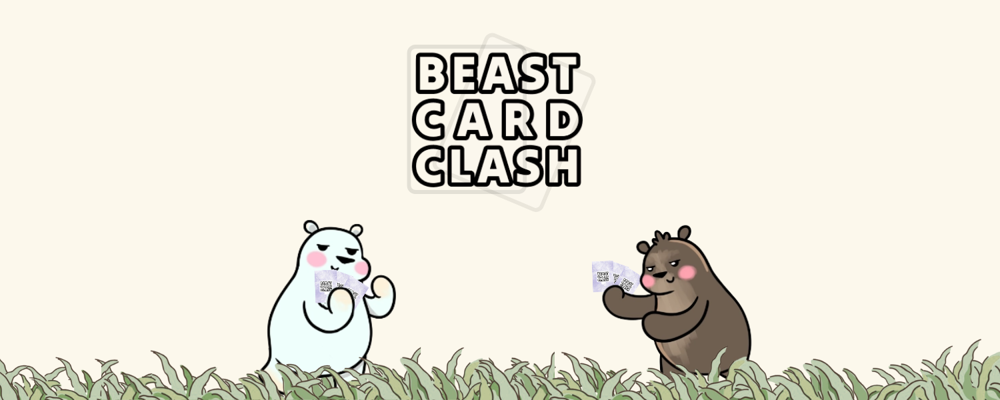

# Inicio

¡Bienvenido a Beast Card Clash! Este es un juego de cartas basado en Card Jitsu de Club Penguin también inspirado por la fauna colombiana y la cultura de la Universidad Nacional de Colombia.

En este sitio encontrarás la documentación (la mayoría técnica) del juego, incluyendo arquitectura, funcionamiento del juego y mucho más. Consulta links a otros recursos [aquí](https://linktr.ee/beast_card_clash).
